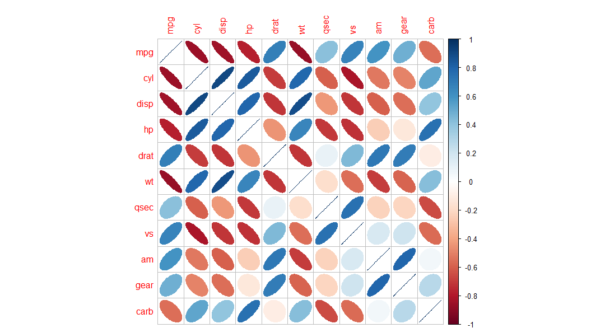

# corrplot

The R package **corrplot** package is an elegant visualization tool for correlation matrix and confidence interval. It also contains some algorithms to do matrix reordering. In addition, corrplot is good at details, including choosing color, text labels, color labels, layout, etc.


## Installation
You can install the stable version on [CRAN](http://cran.r-project.org/package=corrplot):

```r
install.packages('corrplot', dependencies = TRUE)
```

## Usage

```r
library(corrplot)
?corrplot
example(corrplot)
```

An example for correlation matrix:

```r
library(corrplot)
M <- cor(mtcars)
corrplot(M, method = "ellipse")
```



For more examples, see its
[vignette](http://cran.r-project.org/web/packages/corrplot/vignettes/corrplot-intro.html).

## License
This package is free and open source software, licenced under GPL
