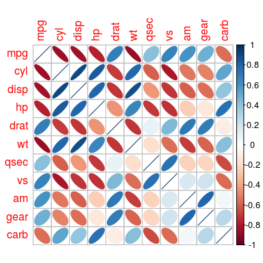

[](https://travis-ci.org/taiyun/corrplot)
[](https://codecov.io/github/taiyun/corrplot?branch=master)
[](http://cran.r-project.org/package=corrplot)

[](http://issuestats.com/github/taiyun/corrplot)
[](http://issuestats.com/github/taiyun/corrplot)
[](https://gitter.im/taiyun/corrplot?utm_source=badge&utm_medium=badge&utm_campaign=pr-badge&utm_content=badge)

## Summary
The R package **corrplot** is for visualizing correlation matrices and
confidence intervals. It also contains some algorithms to do matrix
reordering. For examples, see its
[vignette](http://cran.r-project.org/web/packages/corrplot/vignettes/corrplot-intro.html).

This package is licensed under GPL, and available on CRAN:
<http://cran.r-project.org/package=corrplot>.

## Basic example
```r
library(corrplot)
M <- cor(mtcars)
corrplot(M, method = "ellipse")
```


## Download and Install
To download the development version of the package, type the following at the R command line:
```r
install.packages("devtools")
devtools::install_github("taiyun/corrplot")
```

To download the release version of the package on CRAN, type the following at the R command line:
```r
install.packages("corrplot")
```

## For Developers ###
### How to contribute
- Fork, clone, edit, commit, push, create pull request
- Use RStudio
- Unit-testing: press `CTRL+SHIFT+T` in RStudio
  - we know that is hard to write tests especially for a visual package like this

### How to perform static code analysis and style checks
We use `lintr` which also performs the analysis on Travis-CI.
Configuration for `lintr` is in `.lintr` file.
Lints are treated as warnings, but we strive to be lint-free.

In RStudio, you can run `lintr` from the console as follows:
```r
> lintr::lint_package()
```

### Who do I talk to? ###
- [Wei Taiyun](https://github.com/taiyun) (main)
- [Viliam Simko](https://github.com/vsimko) (backup)

## Other links
- Corrplot listed at OpenHub: https://www.openhub.net/p/corrplot
- CRAN: http://cran.r-project.org/web/packages/corrplot

